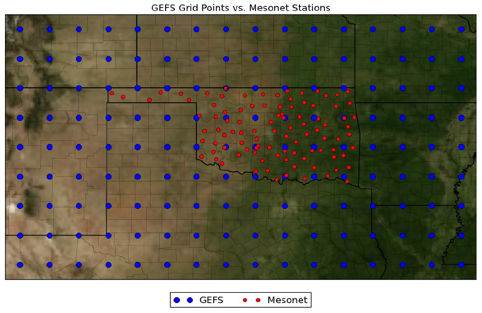

# Predicting solar energy production with Scikit-learn and PySpark

## Introduction:
Nowadays, electricity networks of advanced countries rely more and more in non-operable renewable energy sources, mainly wind and solar. However, in order to integrate energy sources in the electricity network, it is required that the amount of energy to be generated to be forecasted 24 hours in advance, so that energy plants connected to the electricity network can be planned and prepared to meet supply and demand during the next day (For more details, check “Electricity Market” at Wikipedia).

This is not an issue for traditional energy sources (gas, oil, hydropower, …) because they can be generated at will (by burning more gas, for example). But solar and wind energies are not under the control of the energy operator (i.e. they are non-operable), because they depend on the weather. Therefore, they must be forecasted with high accuracy. This can be achieved to some extent by accurate weather forecasts. The Global Forecast System (GFS, USA) and the European Centre for Medium-Range Weather Forecasts (ECMWF) are two of the most important Numerical Weather Prediction models (NWP) for this purpose.

Yet, although NWP’s are very good at predicting accurately variables like “Downward long-wave radiative flux average at the surface”, related to solar radiation, the relation between those variables and the electricity actually produced is not straightforward. Machine Learning models can be used for this task.
In particular, we are going to use meteorological variables forecasted by GFS as input attributes to a machine learning model that is able to estimate how much solar energy is going to be produced at one of the solar plants in Oklahoma. See the figure below, where the red points are the solar plants and the blue points are locations for which meteorological predictions are provided (by GFS).

For this particular dataset, GFS gives a forecast everyday at 00:00 UTC for next day, at 5 times: 1 (12h), 2 (15h), 3 (18h), 4 (21h), 5 (24h), for 15 meteorological variables (apcp_sfc, dlwrf_sfc, …) at each of the blue points in the grid. If V_t_o is the forecast for variable V at time t at location o, then the problem to be solved is to find f such that
energy_nextday = f(apcp_sf1_1, apcp_sf2_1, …, apcp_sf5_1, dlwrf_s1_1, dlwrf_s2_1,…, uswrf_s4_16, uswrf_s5_16)
Two files are provided, train and test. The train dataset contains data from 1994-2007 (one day per row) and the test dataset, for 2008-2009. Given that there are 15 meteorological variables, forecasted for 5 different times of the day, at 16 locations (blue points) around the solar plant of interest (red point), the total number of input attributes is 15*5*16 = 1200. The last column (energy) is the response variable.

